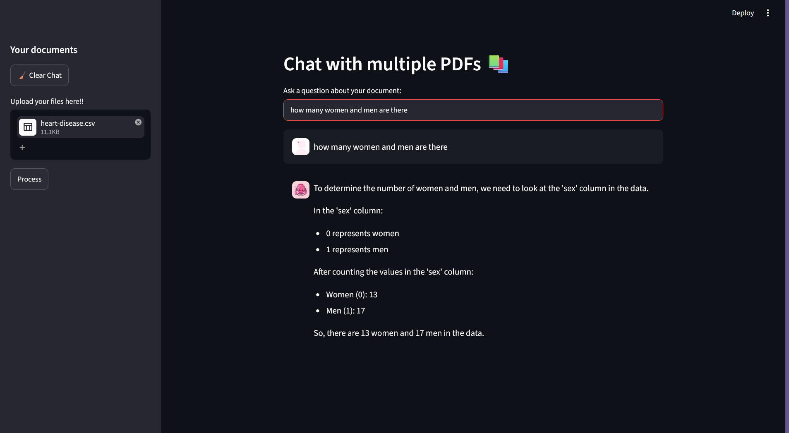

# 📚 Multi-Document Conversational AI Assistant

An AI-powered Retrieval-Augmented Generation (RAG) application that enables users to upload and interact with multiple document formats, including PDF, CSV, and Excel files, through natural language conversations.

The application extracts content from uploaded documents, converts it into semantic vector embeddings, stores them in a FAISS vector database, retrieves the most relevant context, and generates accurate, context-aware responses using Llama 3 through Groq.

---

## 🚀 Features

* Upload and analyze multiple PDF, CSV, and Excel files
* Conversational question answering over uploaded documents
* Retrieval-Augmented Generation (RAG)
* Semantic search using vector embeddings
* Multi-document knowledge retrieval
* Conversational memory for contextual interactions
* Fast inference using Llama 3 via Groq
* Interactive Streamlit web application
* Supports structured and unstructured data sources

---

## 🏗️ Architecture

Documents (PDF / CSV / Excel)
↓
Data Extraction
↓
Text Chunking
↓
Hugging Face Embeddings
(all-MiniLM-L6-v2)
↓
FAISS Vector Database
↓
Semantic Retrieval
↓
Llama 3 (Groq)
↓
Context-Aware Response

---

## 🛠️ Tech Stack

### Programming Language

* Python

### AI & LLM Frameworks

* LangChain
* Retrieval-Augmented Generation (RAG)
* Llama 3 (Groq)
* Hugging Face Sentence Transformers

### Vector Database

* FAISS

### Data Processing

* PyPDF2
* Pandas
* OpenPyXL

### Frontend

* Streamlit

### Supporting Libraries

* langchain-groq
* langchain-huggingface
* langchain-community
* sentence-transformers
* python-dotenv

---

## 💡 How It Works

1. Users upload PDF, CSV, or Excel documents.
2. Content is extracted and converted into text.
3. Documents are split into manageable chunks.
4. Semantic embeddings are generated using all-MiniLM-L6-v2.
5. Embeddings are stored in a FAISS vector database.
6. User queries are embedded and matched against document vectors.
7. Relevant document chunks are retrieved.
8. Retrieved context is provided to Llama 3 via Groq.
9. The model generates accurate responses grounded in the uploaded documents.

---

## 📸 Project Demo
https://multi-pdf-rag-chatbot-nrrjelzwcxfdeopsw6ykok.streamlit.app/

## 📸 Screenshots

  

  

  

  

---

## 🎯 Skills Demonstrated

* Large Language Models (LLMs)
* Retrieval-Augmented Generation (RAG)
* Vector Databases
* Semantic Search
* Embedding Models
* Conversational AI
* LangChain Development
* Streamlit Deployment
* API Integration
* Data Processing
* Prompt Engineering

---

## Future Enhancements

* Source citations and document references
* Chat history export
* Data visualization for CSV and Excel files
* Multi-user support
* Cloud deployment and monitoring
* Agentic workflows for document analysis

---

## 👨‍💻 Author

Nithisa Murugesan

GitHub: https://github.com/NithisaMurugesan

