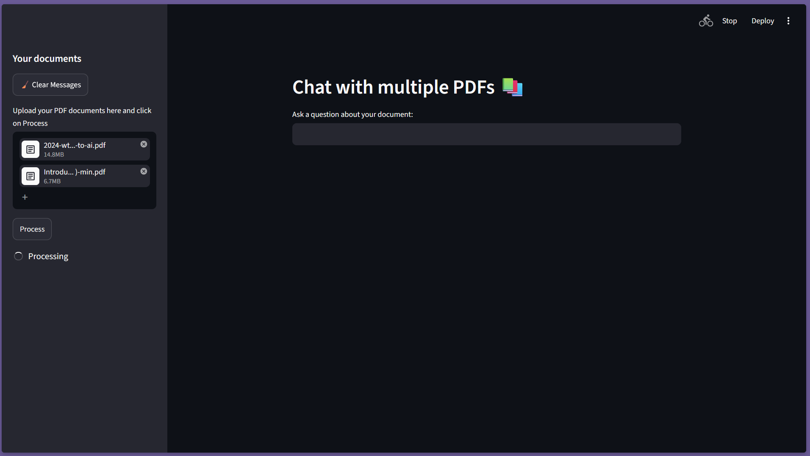
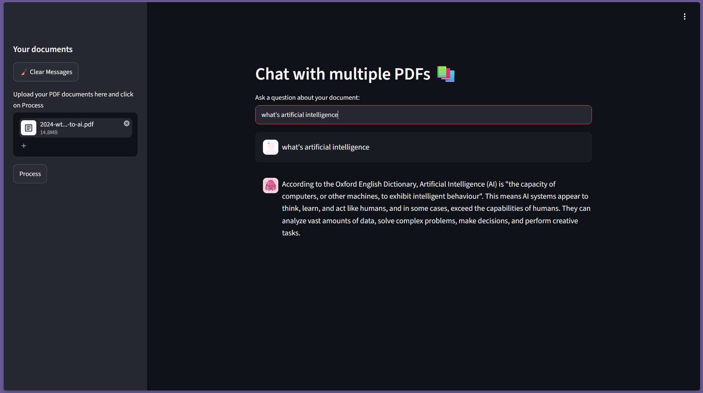
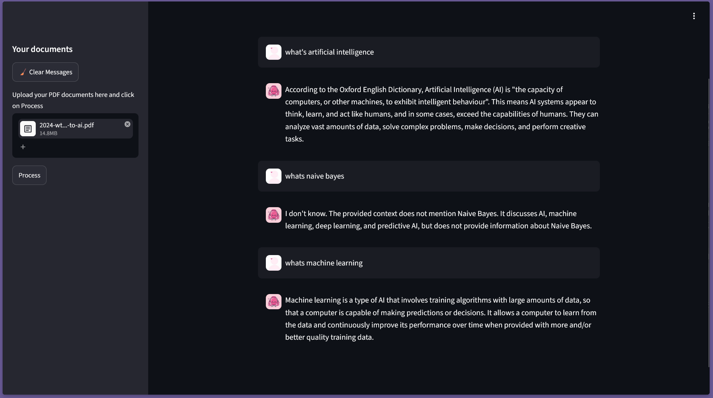

# 📚 Multi-PDF Conversational AI Assistant

A Retrieval-Augmented Generation (RAG) application that enables users to upload multiple PDF documents and interact with them through natural language conversations.

The application extracts text from uploaded PDFs, converts the content into semantic embeddings, stores them in a FAISS vector database, retrieves relevant context, and generates accurate responses using Llama 3 via Groq.

---

## 🚀 Features

* Upload and process multiple PDF documents
* Conversational question answering over PDFs
* Retrieval-Augmented Generation (RAG)
* Semantic search using vector embeddings
* Conversation memory for contextual responses
* Fast inference using Llama 3 on Groq
* Interactive Streamlit web interface
* Multi-document knowledge retrieval

---

## 🏗️ Architecture

PDF Documents
↓
PyPDF2 Text Extraction
↓
Text Chunking
↓
Hugging Face Embeddings
(all-MiniLM-L6-v2)
↓
FAISS Vector Store
↓
Retriever
↓
Llama 3 (Groq)
↓
Generated Response

---

## 🛠️ Tech Stack

### Programming Language

* Python

### AI / Machine Learning

* LangChain
* Retrieval-Augmented Generation (RAG)
* Hugging Face Embeddings
* Llama 3 (Groq)

### Vector Database

* FAISS

### Frontend

* Streamlit

### Document Processing

* PyPDF2

### Environment Management

* Python Virtual Environment
* python-dotenv

---

## 📦 Installation

Clone the repository:

git clone https://github.com/NithisaMurugesan/multi-pdf-rag-chatbot.git

cd multi-pdf-rag-chatbot

Install dependencies:

pip install -r requirements.txt

Create a .env file:

GROQ_API_KEY=your_groq_api_key

Run the application:

streamlit run app.py

---

## 📸 Project Demo
https://multi-pdf-rag-chatbot-nrrjelzwcxfdeopsw6ykok.streamlit.app/

## 📸 Screenshots

  

  

  

---

## 💡 How It Works

1. Upload one or more PDF documents.
2. Text is extracted using PyPDF2.
3. Documents are split into manageable chunks.
4. Chunks are converted into embeddings using all-MiniLM-L6-v2.
5. Embeddings are stored in a FAISS vector database.
6. User questions are converted into embeddings.
7. Relevant document chunks are retrieved using similarity search.
8. Retrieved context is sent to Llama 3 through Groq.
9. The model generates context-aware answers.

---

## 🎯 Skills Demonstrated

* Large Language Models (LLMs)
* Retrieval-Augmented Generation (RAG)
* Vector Databases
* Semantic Search
* Prompt Engineering
* Conversational AI
* LangChain Development
* Streamlit Deployment
* API Integration
* Python Development

---

## 👨‍💻 Author

Nithisa Murugesan

GitHub: https://github.com/NithisaMurugesan
